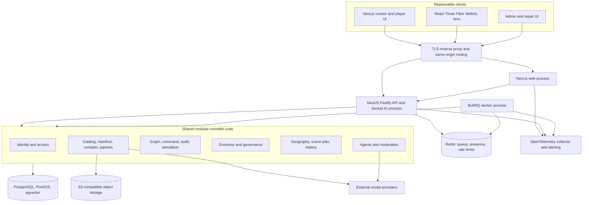
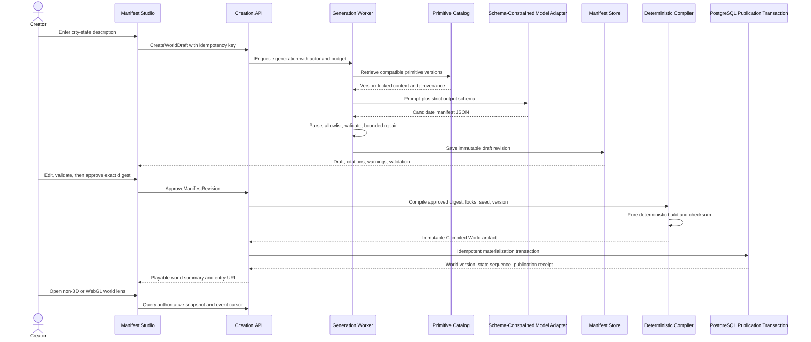
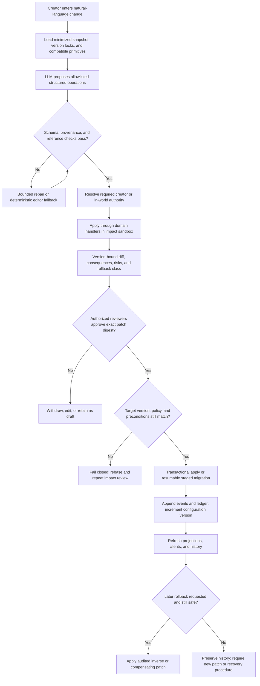
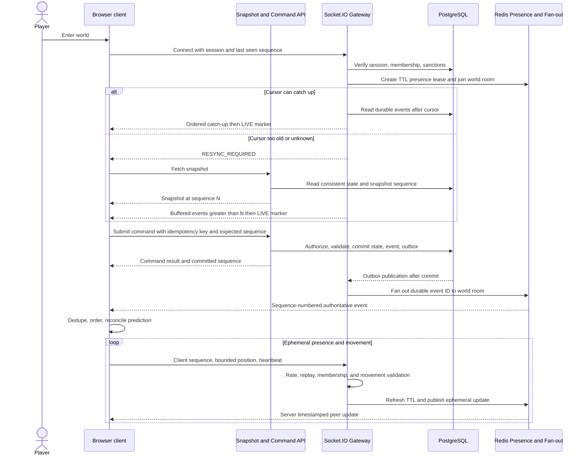
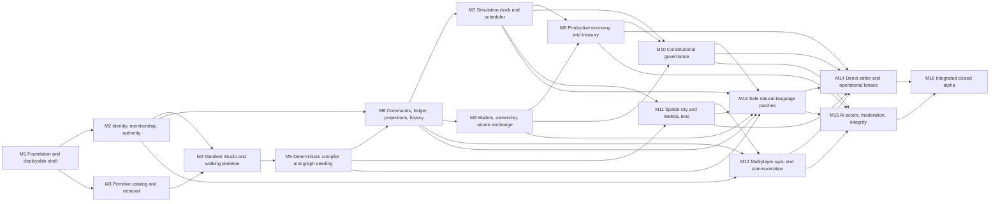

# WorldGraph (Anvil) — Closed-Alpha MVP Roadmap

## A. Executive interpretation

WorldGraph is an AI-native civilization builder: a creator describes a society, reviews a versioned declarative specification, compiles that specification into an authoritative persistent world, and then invites people and bounded AI actors to inhabit and change it through the world's economy, institutions, and laws. Its differentiation is not prompt-to-3D generation. It is prompt-to-operating-society: one governed, auditable model supports creation, play, markets, politics, simulation, history, and multiple interchangeable views.

The closed-alpha MVP is deliberately one world archetype: a small multiplayer city-state with several districts, one closed-loop currency, one production chain, property and commerce, a treasury and tax, a charter, a council, offices, proposals, voting, elections, shared presence and chat, a deterministic clock, controlled creator patches, direct inspection/editing, and a stylized low-poly WebGL projection. It excludes real money, user code, photorealism, planet scale, complex combat, unconstrained autonomous agents, and broad support for arbitrary political or economic systems.

The most important sequencing decision is to make the manifest, compiler, authoritative WorldGraph, command/event boundary, and deterministic simulation useful before investing in a sophisticated 3D environment. By the end of Milestone 4 a creator can already sign in, prompt for a constrained city-state, review and approve a simple manifest, compile it, and inspect a persisted entity and relationship in a two-dimensional representation. Milestone 5 replaces the thin walking-skeleton compiler with deterministic seeding; Milestones 6–10 make the world behave as an auditable society; only then does Milestone 11 add the WebGL projection.

This order is a product requirement, not merely an implementation preference. Geography, balances, ownership, authority, laws, ticks, and outcomes need one server-side meaning that can be tested without rendering. If a 3D scene comes first, identifiers, relationships, and rules leak into scene objects, visual interactions become accidental business logic, and later multiplayer reconciliation becomes a rewrite. When authoritative state comes first, the WebGL client is a replaceable lens: it reconstructs a scene from versioned query APIs and events, sends the same validated commands as any other client, and can fail without stopping the world.

The delivery plan is exactly 16 milestones. Each ends in a deployable state, preserves the prior path, adds migrations and automated tests when data changes, and carries forward an implementation summary, schema changes, migration state, test results, and architecture decisions to the next milestone. The critical path reaches an integrated multi-user city-state in Milestone 16; security, auditability, provenance, abuse controls, observability, and recovery are incremental concerns throughout rather than a final hardening veneer.

## B. Assumptions and decisions

### Product and delivery assumptions

- A small, capable team can spend roughly one to three weeks per milestone. Large milestones require parallel ownership within the same milestone but still integrate behind one deployable release.
- The repository begins empty or nearly empty. Milestone 1 establishes conventions; later milestones must inspect and preserve the actual repository rather than recreating the plan from memory.
- Closed alpha targets tens of concurrent participants in a world and low hundreds across the installation, with a tested target of 50 concurrent WebSocket sessions in one world. Capacity is an acceptance target, not a promise of Internet scale.
- One deployment may host multiple city-state worlds, but each authoritative record is tenant-scoped by world_id and authorization always checks membership in that world.
- A world has one creator-owner initially. Ownership transfer and collaborative creator teams are post-MVP; creator delegates can receive explicit roles without becoming owners.
- Human accounts may control one active character per world in the MVP. One account can join multiple worlds.
- The initial city-state primitive pack is curated and shipped by the product team. User-authored executable behaviors and public primitive publishing are out of scope.
- English is the authoring and moderation language for closed alpha. User-visible data is Unicode-safe and localization-ready, but localization is post-MVP.
- The virtual currency is closed-loop, has no purchase, redemption, cash-out, or external exchange path, and is always labeled as fictional. Amounts use integer minor units; floating-point money is prohibited.
- Secret ballots mean confidential application-level ballots: choices are hidden from ordinary users and normal operators, encrypted at rest, and revealed only to the tally path or an explicitly audited repair role. Cryptographic coercion resistance and public zero-knowledge verification are not MVP claims.
- The city is a bounded, local planar space measured in meters rather than an Earth geolocation. A world may optionally carry map metadata later.
- Runtime simulation is turn/tick deterministic. Wall-clock catch-up is bounded; a long outage cannot trigger an unbounded burst of economic production.
- LLM availability, cost, or quality cannot block a user from opening, validating, compiling, or playing an already approved world. Curated deterministic templates provide a creation fallback.
- Generated 3D assets are not required. Milestone 11 composes an allowlisted low-poly kit and procedural geometry from a visual plan; object storage holds approved assets and derivatives.
- Creator repair power is necessary in alpha but never implicit. An override carries reason, scope, actor, before/after evidence, and a visually distinct ledger entry.
- Supported rollback is compensating or snapshot-assisted, never silent deletion of history. Financial transfers, consumed resources, published votes, and other irreversible consequences are not erased.
- Backward compatibility applies to public APIs, persisted schemas, manifest versions, primitive versions, compiler artifacts, and event payloads. A breaking change requires an explicit version and migration.
- Compliance scope is a private closed alpha with no real-money activity. Privacy, deletion/export, content reporting, and retention controls are still designed in; jurisdiction-specific regulated-product work is not inferred.

### Chosen stack

| Layer                      | Selection                                                                                                                                                                             |
| -------------------------- | ------------------------------------------------------------------------------------------------------------------------------------------------------------------------------------- |
| Language and repository    | Strict TypeScript in a pnpm workspace with Turborepo; Node.js active LTS; shared ESLint, formatting, type-check, and test configuration                                               |
| Browser application        | Next.js App Router and React; accessible server-rendered shell with client components only where interaction requires them                                                            |
| 3D client                  | React Three Fiber over Three.js, using instancing, deterministic scene adapters, and an allowlisted low-poly asset kit                                                                |
| API and realtime           | NestJS modular monolith on the Fastify adapter; REST/OpenAPI for commands and queries; Socket.IO gateway for world rooms, acknowledgements, reconnects, and presence                  |
| Validation and contracts   | JSON Schema 2020-12 with AJV for manifests, primitives, AI outputs, and versioned event payloads; TypeBox-generated TypeScript types where practical                                  |
| Authoritative storage      | PostgreSQL with PostGIS, pgvector, JSONB for schema-backed documents, relational tables for integrity-sensitive state, and database constraints as the last line of defense           |
| Data access and migrations | Drizzle ORM/query builder plus reviewed SQL migrations for PostGIS, vector indexes, partial indexes, triggers, and hard invariants                                                    |
| Jobs and ephemeral state   | Redis and BullMQ for generation, compilation, indexing, bounded simulation work, and retryable projections; Redis TTL state for presence and rate limits only                         |
| Assets                     | S3-compatible object storage; MinIO in local development; immutable content hashes and provenance metadata                                                                            |
| Authentication             | Auth.js with standards-based OIDC and passwordless email, database-backed sessions, secure same-site HTTP-only cookies, CSRF protection, and a shared server-side session verifier    |
| AI integration             | Provider-neutral server adapter with schema-constrained responses, prompt/template versions, retrieval citations, cost budgets, timeouts, and deterministic no-AI fallbacks           |
| Tests                      | Vitest, Testcontainers-backed PostgreSQL/Redis integration tests, fast-check property tests, Playwright browser tests, and deterministic golden worlds                                |
| Operations                 | Docker Compose locally; three deployable process roles from one codebase (web, API/realtime, worker); managed PostgreSQL, Redis, and object storage in a small production environment |
| Observability              | OpenTelemetry traces and metrics, structured JSON logs, correlation/command IDs, Sentry-compatible error capture, and dashboards/alerts defined as code                               |

### Major architectural decisions

| Decision                                                                                                                                                | Reason                                                                                                                                                                                                      | Main alternative considered                                            | Why not selected for the MVP                                                                                                                               | Revisit when                                                                                                                                                            |
| ------------------------------------------------------------------------------------------------------------------------------------------------------- | ----------------------------------------------------------------------------------------------------------------------------------------------------------------------------------------------------------- | ---------------------------------------------------------------------- | ---------------------------------------------------------------------------------------------------------------------------------------------------------- | ----------------------------------------------------------------------------------------------------------------------------------------------------------------------- |
| Build a modular monolith with explicit domain modules and three process roles.                                                                          | Transactions across economy, governance, ownership, and audit remain simple while module contracts prevent a ball of mud. Web, API, and workers can scale independently without becoming separate products. | Domain microservices with a message broker.                            | Distributed transactions, schema coordination, local-development cost, and operational burden are unjustified at alpha scale.                              | A measured workload needs independent scaling or failure isolation, a module has a stable contract and separate team, and outbox/event semantics are production-proven. |
| Use PostgreSQL as the sole authoritative database, with relational graph tables and graph-oriented query services.                                      | Foreign keys, transactions, unique constraints, recursive CTEs, PostGIS, JSONB, and vectors cover the MVP while keeping ownership and money atomic.                                                         | Neo4j or another dedicated graph database.                             | It creates dual-write/consistency problems and does not improve the bounded city-state traversals enough to offset them.                                   | Traversals become the measured bottleneck after indexing/materialized views, or the product needs deep, unbounded graph analytics that PostgreSQL cannot meet.          |
| Use transactional state plus an append-only world ledger and outbox, not pure event sourcing.                                                           | Canonical current state is straightforward to query and constrain, while accepted/rejected commands and events remain auditable and projections replayable.                                                 | Pure event sourcing with all state reconstructed from events.          | Projection versioning, event evolution, debugging, and full replay increase early complexity; hard relational invariants are easier on materialized state. | Repeated temporal/branching requirements make events the natural source of truth and the team has mature replay/schema governance.                                      |
| Keep one database schema but enforce module ownership and world scoping.                                                                                | Cross-domain transactions remain possible; migrations and backup are manageable. Tables have one writer module even when read through views.                                                                | Database-per-domain.                                                   | Cross-database atomicity would weaken the ledger, wallet, tax, and governance flows.                                                                       | A module is extracted as a service or regulatory/data-residency boundaries demand physical separation.                                                                  |
| Treat the World Manifest as immutable, versioned design input and runtime state as separate records.                                                    | Review, reproducibility, diffs, migrations, and provenance require immutable approved inputs; play state changes far more frequently.                                                                       | Keep a single mutable world document.                                  | It conflates intent with history, makes validation/race handling unclear, and encourages full regeneration.                                                | Do not revisit the separation; only revise representation and versioning mechanics.                                                                                     |
| Make compilation a deterministic, side-effect-free planning phase followed by one idempotent transactional materialization phase.                       | The same approved manifest, primitive locks, seed, and compiler version must yield the same artifact digest; retries cannot duplicate a world.                                                              | Let generation write entities directly as it streams.                  | Partial worlds, irreproducible IDs, and retry duplication would be inevitable.                                                                             | World scale exceeds one transaction; then use a staged namespace and atomic publication pointer without weakening deterministic output.                                 |
| Use JSON Schema 2020-12 plus canonical JSON and YAML as an authoring projection.                                                                        | The same versioned contract can validate UI edits, compiler input, retrieved primitives, and LLM output; canonical JSON supports stable hashing.                                                            | TypeScript-only validators or executable manifest scripts.             | Type-only contracts are not portable; arbitrary scripts violate the security boundary.                                                                     | Another declarative schema can demonstrate better tooling while preserving language neutrality, migrations, and safe evaluation.                                        |
| Use UUIDv5 identifiers derived from compilation namespace/path for compiler-created records and UUIDv7 for runtime-created records.                     | Deterministic IDs make retries, diffs, golden tests, and provenance reliable; time-sortable runtime IDs aid operations.                                                                                     | Auto-increment IDs or random UUIDs everywhere.                         | They make compiled output sensitive to insertion order or irreproducible.                                                                                  | A different standard offers equivalent determinism and tooling without data migration risk.                                                                             |
| Separate configuration version, runtime schema version, and event sequence.                                                                             | A patch targets a stable configuration version, deployments migrate runtime schemas, and high-frequency play advances an independent state sequence.                                                        | One overloaded world version counter.                                  | It creates false patch conflicts and cannot distinguish product migrations from world evolution.                                                           | Do not collapse them; add dimensions only if new lifecycle concepts demand them.                                                                                        |
| Use authenticated commands as the only mutation entrance, including simulation, administrators, creators, and AI actors.                                | Authorization, idempotency, audit, rate limits, and invariant enforcement become uniform.                                                                                                                   | Allow internal jobs or privileged tools to update tables directly.     | Bypass paths inevitably cause unaudited balances, ownership, or laws.                                                                                      | Do not revisit the invariant; optimize command batching internally if measured throughput requires it.                                                                  |
| Commit state, domain events, ledger entries, and an outbox row in the same PostgreSQL transaction.                                                      | Realtime and workers can be at-least-once without losing events or publishing uncommitted state.                                                                                                            | Publish directly to Redis or a broker during the transaction.          | Network publication cannot be made atomic with PostgreSQL and produces ghost or missing updates.                                                           | A distributed log is justified by scale; retain a transactional outbox or CDC boundary.                                                                                 |
| Use fixed-point bigint amounts and double-entry postings for currency.                                                                                  | Conservation, reconciliation, tax allocation, and no-negative-balance rules become testable.                                                                                                                | A balance column updated with floating-point arithmetic or blockchain. | Floating point breaks money invariants; blockchain adds no value to a closed-loop centrally governed simulation.                                           | Credit instruments require explicit liability accounts and risk rules; real-money consideration would require a separate regulated product decision.                    |
| Model ownership once as temporal asset title records, with one active owner constraint.                                                                 | Property, items, organizations, and government holdings share a single auditable invariant.                                                                                                                 | Per-domain owner columns.                                              | Multiple representations drift and make atomic sale transfer unsafe.                                                                                       | Some relationship is not legally/exclusively ownership; model it separately rather than weakening title.                                                                |
| Advance simulation in discrete deterministic ticks with seeded PRNG streams and fenced database leases.                                                 | Tests and reconstruction can reproduce outcomes; only one worker commits a tick; wall-clock timing does not alter rules.                                                                                    | Continuous wall-clock callbacks or LLM decisions inside a tick.        | They are nondeterministic, fragile during outages, and hard to reconcile.                                                                                  | Profiling proves the tick model cannot meet scale; preserve deterministic step semantics even if execution is partitioned.                                              |
| Keep LLMs outside the transaction and authority boundary.                                                                                               | Models can interpret, retrieve, and propose typed artifacts, but schemas, allowlists, permissions, deterministic rules, and human approvals decide what changes.                                            | Agent/tool access that writes authoritative storage.                   | Prompt injection, model variance, and confused-deputy attacks would become state corruption paths.                                                         | Do not revisit direct write prohibition; approval policy can become more granular with demonstrated safety.                                                             |
| Use curated provider-neutral AI adapters and store full provenance, while redacting sensitive prompt data.                                              | Providers and models change; the product needs reproducibility metadata, cost control, and safe fallback without locking domain code to one SDK.                                                            | Embed one provider SDK throughout modules.                             | It couples product behavior and data handling to unstable APIs.                                                                                            | A provider-specific capability is indispensable; isolate it behind a versioned adapter.                                                                                 |
| Use local planar PostGIS geometry and derive render coordinates.                                                                                        | Server-side containment, adjacency, parcel overlap, and route validation are authoritative while the renderer can choose its own origin and level of detail.                                                | Store Three.js scene coordinates or GeoJSON blobs only.                | Scene coordinates make the client authoritative; blobs cannot enforce spatial constraints or index queries effectively.                                    | Earth anchoring, spherical worlds, or very large maps require a formal spatial-reference migration.                                                                     |
| Use Socket.IO for ephemeral connections and durable sequence-numbered events for recovery.                                                              | Rooms, heartbeat, acknowledgement, reconnection, and browser support accelerate alpha; missed durable state is recovered from the API/event cursor, not trusted to Redis.                                   | Raw WebSocket protocol or peer-to-peer networking.                     | Raw protocol adds reliability work; P2P undermines authority and moderation.                                                                               | Protocol overhead is a measured bottleneck or a native client needs a smaller binary protocol.                                                                          |
| Deploy one regional installation with managed data services and Docker artifacts.                                                                       | It is supportable by a small team, compatible with modular-monolith transactions, and enough for closed alpha.                                                                                              | Kubernetes, Kafka, multi-region active-active.                         | They add failure modes before scale, latency, or availability evidence exists.                                                                             | SLOs, regional latency, or measured capacity require them and recovery procedures are mature.                                                                           |
| Use forward-only schema migrations and explicit data migrations; world patches use compensating rollback or snapshot restore according to an allowlist. | Database deployment rollback and in-world historical reversal are different problems and must be auditable.                                                                                                 | Down-migrate production or delete post-patch history.                  | Destructive reversals can corrupt data and falsify history.                                                                                                | Restore drills or patch classes reveal a safer reversible mechanism; never erase ledger history.                                                                        |
| Define secret-ballot confidentiality honestly, not as cryptographic anonymity.                                                                          | Envelope encryption, split access, disclosure policy, and audited repair satisfy the closed-alpha need without making false guarantees.                                                                     | Public ballots only, or a full end-to-end cryptographic voting system. | Public-only cannot represent the requirement; cryptographic voting is disproportionate and raises usability/recovery complexity.                           | Threat model requires coercion resistance, public verifiability, or protection from database administrators.                                                            |
| Ship security and moderation controls incrementally and threat-model high-risk milestones.                                                              | Identity, money, governance, realtime, patches, and AI each introduce distinct abuse paths that cannot be patched at the end.                                                                               | A dedicated security milestone only.                                   | Late controls would require contract and data-model rewrites.                                                                                              | Controls are never removed; reassess threat models at Milestones 4, 8, 10, 13, 15, and before alpha.                                                                    |

### Data ownership rules

- Identity owns users, credentials/provider links, sessions, and administrative identity status.
- Access owns worlds, memberships, invitations, roles, capabilities, and delegation/override policy. Other modules ask it for decisions and do not infer authority from UI state.
- Catalog owns immutable primitive versions, compatibility/dependency metadata, documentation, provenance, and embeddings. It does not own instantiated runtime entities.
- Manifest owns immutable revisions, review state, approvals, validation reports, generation attempts, and provenance. It never owns runtime mutable state.
- Compiler owns immutable compiled artifacts, digests, seed metadata, visual plans, and materialization receipts. It may create initial runtime records only through its idempotent publication boundary.
- Graph owns entity identity, typed relationships, entity lifecycle, spatial references, and graph queries. Domain modules own their domain-specific rows and reference graph entity IDs.
- Command/Audit owns command receipts, domain events, the append-only world ledger, outbox, idempotency records, and projection checkpoints. It does not contain domain decision rules.
- Simulation owns clocks, ticks, scheduled jobs, deterministic random streams, and simulation rules. It proposes commands; it does not bypass domain modules.
- Economy owns currencies, accounts/wallets, journal transactions/postings, assets/titles, resources, recipes, businesses, employment, orders/trades, treasury, and tax assessments.
- Governance owns charters, institutions, jurisdictions, laws, offices/terms, proposals, ballots/votes, elections/results, authority effects, and public-budget authorizations.
- Realtime owns connections, presence leases, room subscriptions, chat, delivery cursors, and event fan-out. Presence is ephemeral; durable outcomes come only from authoritative APIs/events.
- Geography owns territories, districts, parcels, roads, building footprints, containment/adjacency, and render transforms; Scene owns only derived visual-plan and presentation adapters.
- Patches owns immutable patch proposals, structured operations, impact reports, approvals, migration runs, application receipts, and rollback eligibility. Applied changes call owning modules through commands.
- Agents owns AI actor identities, plans, budgets, and action proposals. It has no privileged data-write path.
- Moderation owns reports, sanctions, policy decisions, chat/content moderation evidence, and appeals. Sanctions are enforced through Access and Realtime.

## C. System architecture

### Architectural shape

The codebase is a TypeScript modular monolith organized by bounded domain rather than technical layer. It produces three independently runnable artifacts from the same versioned source: a Next.js web process, a NestJS API/realtime process, and a BullMQ worker process. Domain packages expose application commands, queries, policies, and versioned contracts. Infrastructure packages implement PostgreSQL repositories, Redis delivery, object storage, AI providers, email, and telemetry. Domain code cannot import React, NestJS controllers, Redis, provider SDKs, or Three.js.

The initial repository shape is:

- apps/web: creator studio, operational lenses, and WebGL client.
- apps/api: authenticated REST/OpenAPI endpoints, command gateway, query endpoints, health endpoints, and Socket.IO gateway.
- apps/worker: primitive indexing, AI generation, compilation, outbox publication, projection updates, scheduled simulation, impact analysis, and maintenance jobs.
- packages/contracts: versioned TypeScript/JSON Schema contracts and error codes shared by server and clients.
- packages/domain: bounded modules for identity, access, catalog, manifests, compiler, graph, command/audit, simulation, economy, governance, geography, patches, agents, moderation, and history.
- packages/db: Drizzle models, explicit transaction helpers, SQL migrations, seeds, row-lock helpers, and generated schema metadata.
- packages/platform: authentication adapter, AI adapter, job queue, object store, telemetry, feature flags, mail, clock, and deterministic PRNG implementations.
- packages/test-worlds: golden manifests, primitive locks, compiled snapshots, deterministic seeds, fixture users, and cross-domain scenario drivers.

Within each module, dependency direction is transport adapter → application use case → domain rules → declared repository/port. Infrastructure implements ports and is wired only at composition roots. A module may read another module through an explicit query interface and may change it only through an application command. It may react asynchronously to a published domain event when immediate atomic consistency is unnecessary. Cycles are prohibited in the static module graph; shared concepts are contracts or value objects, not a shared catch-all service.

### Diagram 1 — High-level component architecture



PostgreSQL is the only authoritative store. Redis loss may interrupt jobs, presence, or realtime fan-out, but it cannot change balances, ownership, laws, votes, or world state. Object storage contains immutable assets and generated artifacts referenced by content hash; database rows hold authorization and provenance. AI providers see only a minimized, policy-approved context and possess no application credentials.

### Prompt-to-play creation flow and compiler boundary

World creation is a staged workflow, not one request that mutates a live world. A generation job extracts intent, retrieves only compatible primitive versions, and asks the model for schema-constrained draft content. The server parses and validates it, attaches provenance, and stores a new immutable draft revision. Invalid output receives bounded schema-repair attempts; a curated deterministic city-state template remains available if AI is unavailable.

Approval locks the exact canonical manifest digest and primitive-version set. Compilation reads only that immutable input. The compiler is a pure transformation from canonical manifest + primitive lock + compiler version + seed to a Compiled World artifact with deterministic IDs, sorted records, checksums, warnings, and a visual plan. It cannot call an LLM, current time, random system entropy, network service, or database sequence. Publication is a separate idempotent transaction that verifies the artifact digest and world state, inserts initial graph/domain records, records the initial configuration/runtime versions, appends ledger/events/outbox rows, and marks the artifact materialized. A retry returns the existing receipt.

Milestone 4 uses a deliberately narrow synchronous compiler adapter to complete the walking skeleton. Milestone 5 preserves its public contract, expands the artifact, moves heavy compilation to the worker, and verifies reproducibility.

### Diagram 2 — Prompt-to-play world creation



### Authoritative command and event flow

Every mutation—human play, creator action, administrator repair, simulation step, governance effect, patch operation, and AI action—starts as a Command Envelope. Transport parsing rejects malformed or oversized requests. Authentication resolves an actor; the command gateway reserves an idempotency key scoped to actor, world, and command type. Access then evaluates role and attributes against the target world and current domain facts. Domain handlers load and lock the minimum aggregates, validate invariants, and commit canonical state, a command receipt, one or more domain events, a ledger entry, and outbox records in one PostgreSQL transaction.

The accepted response returns the committed world state sequence and result. A duplicate with the same key and payload digest returns the original result; the same key with a different digest returns IDEMPOTENCY_CONFLICT. Expected validation, authorization, and conflict failures use stable structured error codes and append a sanitized rejected command receipt/audit entry without emitting a domain event. Unexpected errors roll back completely and carry a correlation ID.

An outbox publisher uses lease-and-skip-locked semantics, publishes at least once, and marks delivery. Every consumer has an inbox/deduplication key. Synchronous transactional projection updates are used when a response depends on them; search, history summaries, notifications, and realtime delivery may lag briefly. Clients never infer committed state from an optimistic animation: they reconcile against command results and sequence-numbered events.

### Diagram 3 — Authoritative state-changing command flow

```mermaid
sequenceDiagram
    actor Actor as Human, creator, simulation, admin, or AI actor
    participant Gateway as Command Gateway
    participant Auth as Session and Access Policy
    participant Handler as Owning Domain Handler
    participant DB as PostgreSQL Transaction
    participant Outbox as Outbox Publisher
    participant Consumers as Projections, history, realtime

    Actor->>Gateway: Versioned command envelope and idempotency key
    Gateway->>Gateway: Parse, size limit, schema validation, replay check
    Gateway->>Auth: Authenticate actor and authorize capability
    Auth-->>Gateway: Decision with policy evidence
    Gateway->>Handler: Execute with actor, world, expected sequence
    Handler->>DB: Begin and lock affected rows
    Handler->>Handler: Validate state transition and invariants
    alt Accepted
        Handler->>DB: Write canonical state
        Handler->>DB: Append receipt, events, ledger, outbox
        DB-->>Handler: Commit with world sequence
        Handler-->>Gateway: Stable result and committed sequence
        Gateway-->>Actor: Success or prior idempotent result
        Outbox->>DB: Lease committed messages
        Outbox->>Consumers: Publish at least once
        Consumers->>Consumers: Dedupe and advance checkpoints
    else Expected rejection
        Handler-->>Gateway: Typed validation, policy, or conflict error
        Gateway->>DB: Append sanitized rejected receipt
        Gateway-->>Actor: Stable error and current sequence
    else Unexpected failure
        DB-->>Handler: Roll back all writes
        Gateway-->>Actor: Correlation ID and retry guidance
    end
```

The domain event stream is ordered per world by state_sequence. Ordering across worlds is irrelevant. Event payloads are immutable and carry event_type plus event_schema_version. Upcasters may support old payloads for projections; published history never rewrites an old event in place. A rare repair emits a compensating event referencing the original and requires a privileged, audited command.

### Natural-language patch and migration boundary

A natural-language edit produces a proposal, not authority. The patch planner receives a minimized snapshot, manifest/configuration metadata, compatible primitives, and the creator request. It returns a schema-constrained list of allowlisted operations such as add_entity, set_parameter, add_relationship, replace_primitive_version, alter_district_boundary, or schedule_scenario. Each operation carries preconditions and references stable identifiers. Free-form SQL, JavaScript, URLs, shell text, opaque executable expressions, and unknown operation types are rejected.

Deterministic validation checks references, schemas, authority, spatial rules, and invariants. An impact sandbox clones only the relevant snapshot into an isolated transaction/schema, applies the candidate through the same module command handlers, and optionally advances a bounded number of deterministic ticks. The report distinguishes certain effects from estimates, includes state/configuration diffs, affected entities, irreversible consequences, performance budget, required authority, and rollback class. The preview is bound to patch digest, target configuration version, target state sequence/range, policy version, and impact-engine version.

Approval does not bypass authority. Creator configuration power, explicit override, officeholder action, council vote, referendum, or constitutional process must resolve to a valid authorization artifact. Application rechecks the target and preconditions, takes a world configuration lock, applies operations transactionally or via a resumable staged migration for explicitly supported large changes, appends history, increments configuration_version, and stores a receipt. A stale or incompatible patch fails closed and must be rebased/reviewed. Rollback is available only when its precomputed strategy remains valid; otherwise the UI offers a new compensating patch or operator-assisted snapshot recovery.

### Diagram 4 — Natural-language patch lifecycle



### Simulation boundary

Each world has an explicit tick duration, simulation status, next due time, maximum catch-up count, deterministic seed, and monotonic last_committed_tick. A scheduler may use wall time to decide that a tick is due, but wall time is never a simulation input. A worker claims a fenced lease, loads the prior tick and scheduled events, derives named PRNG streams from world seed + ruleset version + tick number + subsystem, and asks rules to produce commands. Those commands use the normal gateway under a simulation actor with narrowly scoped capabilities. A unique constraint on world_id plus tick_number and expected state sequence prevents duplicate commit. On failure, the same input can retry; poison events pause that world's clock and alert an operator rather than skipping silently.

Simulation rules are versioned pure functions over declared inputs. LLMs and external HTTP calls cannot execute during a tick. An AI actor may plan asynchronously and submit a bounded action command for a future tick, but validation, resources, permissions, cooldowns, and conflicts are identical to a human command.

### WebGL and geography boundary

The Geography module stores authoritative territory, parcel, road, building footprint, containment, and adjacency data in local planar PostGIS geometry. The compiler emits a Visual World Plan that maps stable entity IDs and geometry to allowlisted style-kit references, semantic layers, interaction capabilities, spawn points, and level-of-detail hints. The scene adapter turns a snapshot plus incremental events into transient Three.js objects. Scene nodes carry entity IDs for selection but do not own balance, title, collision permission, production, or law state.

Movement in closed alpha is client-predicted for responsiveness but bounded and corrected by the server. Authoritative interactions use server-side proximity and capability checks against canonical spatial data. If the renderer is unavailable, the list/map/graph lenses remain fully functional and the simulation continues.

### Realtime synchronization

On connection, the server authenticates the session, verifies active membership and sanctions, and creates a short-lived presence lease. Joining a world room requires a last_seen_sequence. The gateway sends either events after that cursor or instructs the client to fetch a fresh snapshot when retention/gap limits are exceeded. Snapshot responses include the exact sequence at which they were built; buffered later events apply only after snapshot hydration. Durable events are ordered and deduplicated by event ID/sequence. Ephemeral movement, cursor, typing, and presence messages use per-connection client sequence numbers, rate limits, TTLs, and server timestamps and are never mistaken for authoritative history.

Commands travel over REST initially even while the client is connected; this keeps idempotency, structured errors, tracing, and retries uniform. Socket.IO carries committed event notifications, chat, presence, and bounded movement. Chat is durable but not a domain-authoritative mutation; it has separate retention, moderation, reporting, and rate-limit rules.

### Diagram 5 — Multiplayer state synchronization



If a sequence gap is detected, the client stops applying dependent optimistic changes and catches up or rehydrates. Redis reconnection cannot fabricate missing domain events because recovery reads PostgreSQL. Backpressure causes coalescing or dropping only for ephemeral updates; durable events trigger cursor-based resynchronization.

### Persistence and consistency model

- Canonical domain state is normalized relational data with foreign keys, check constraints, unique/partial indexes, and explicit transaction isolation/row locks for contended invariants. JSONB is reserved for validated versioned documents, metadata, and event payloads.
- World graph nodes and typed edges are relational. Edge type definitions declare valid source/target kinds, cardinality, temporal behavior, and whether a domain module owns extra semantics. A single active-edge constraint enforces relationships such as officeholding where required.
- Command receipts, domain events, world ledger entries, accounting journal lines, approved manifest revisions, compiled artifacts, votes after cast, finalized results, patch approvals, and applied migration receipts are append-only or immutable. Corrections reference originals.
- Mutable aggregate tables represent current state: active membership, world status, entity lifecycle, inventory quantities, open orders, office terms before final transition, clock leases, and projection checkpoints. Every update uses revision/sequence checks where concurrent decisions matter.
- Derived projections include graph summaries, search vectors, history narratives, dashboard totals, scene snapshots, and public election tallies. They are rebuildable, versioned by projection code, and expose freshness/checkpoint metadata.
- Per-world state_sequence totally orders committed authoritative events. configuration_version advances only for approved world-design patches/materialization. runtime_schema_version records the compatible deployed state schema. manifest_revision, primitive_version, compiler_version, ruleset_version, event_schema_version, and projection_version remain independently explicit.
- Backups use managed encrypted point-in-time recovery for PostgreSQL, object-store versioning, documented Redis rebuild behavior, and periodic restore drills. Snapshots/checkpoints accelerate world reconstruction but never replace the append-only audit trail.

### Deployment and operational model

Local development runs reproducibly through Docker Compose with PostgreSQL extensions, Redis, MinIO, a mail catcher, and optional telemetry collector. One command applies migrations, seeds the curated primitive pack and golden city-state, and starts all process roles. Tests use isolated databases and deterministic clocks/seeds; no test depends on a live model provider.

Closed alpha uses one region, TLS, private data-service networking, managed encrypted PostgreSQL with point-in-time recovery, managed Redis, versioned S3-compatible storage, and independently scalable web/API/worker containers built from one commit. Migration jobs run once before compatible processes become ready. Readiness checks verify database schema compatibility, Redis availability for relevant process roles, and worker heartbeat; liveness does not incorrectly fail because an optional AI provider is unavailable. Feature flags gate AI generation, patch classes, AI actors, secret ballots, and expensive simulation rules per world.

OpenTelemetry propagates request, command, job, tick, patch, and event correlation IDs. Alerts cover command error rate, outbox lag, projection lag, tick lag/failures, ledger reconciliation, duplicate/rejected economic actions, WebSocket disconnects, AI budget/errors, database saturation, backup age, and restore-test status. Sensitive manifest prompts, chat, secret votes, tokens, and personal data are redacted from logs by default.

## D. Canonical domain contracts

### Contract conventions

All contracts have a stable type name, an explicit schema version, canonical JSON serialization rules, and generated server/client types. Identifiers are opaque strings at API boundaries. Timestamps are UTC RFC 3339 strings for observation and audit only; deterministic decisions use tick numbers, terms, deadlines persisted before execution, and seeded random streams. Every world-scoped record begins with world_id. User-provided names and descriptions are data, never identifiers or executable expressions.

Canonical JSON sorts object keys, normalizes Unicode, rejects duplicate keys and non-finite numbers, and preserves integer quantities without floating-point conversion. Content digests use a documented SHA-256 envelope containing contract type and schema version. Schema evolution is additive when possible; a registry maps every stored document/event version to a validator and, where required, a deterministic migrator/upcaster.

The lifecycle terms below are strict:

- Immutable means content is never updated; a new version/revision or correcting record is inserted.
- Append-only means insertion is allowed and deletion/update is denied to application roles; any correction references an earlier record.
- Mutable means a constrained current-state row may update through an authenticated command with revision checks and audit events.
- Derived means rebuildable from authoritative records and always exposes its projection version/checkpoint.
- Versioned means consumers must select or declare a version rather than assuming latest.

### World Primitive

Responsibility: a reusable, safe, schema-backed design component; it describes configuration and references allowlisted runtime behavior, but cannot contain executable code.

Initial shape:

- primitive_id: stable namespaced identifier independent of version.
- version: immutable semantic version; primary identity is primitive_id plus version.
- schema_version and kind: contract version and allowlisted category such as government, currency, recipe, terrain, role, or style kit.
- title, documentation, tags, locale, semantic_metadata: human and retrieval metadata.
- parameter_schema and defaults: JSON Schema plus values validated against it.
- dependencies: required primitive IDs with version ranges and purpose.
- compatibility: compatible/incompatible kinds, capabilities, manifest schema range, and runtime ruleset range.
- validation_rules: declarative rule IDs and parameters evaluated by an allowlisted engine.
- behavior_refs: identifiers and version ranges of server-shipped rule implementations; no code or URL.
- visual_hints: optional allowlisted style/geometry/material tokens.
- provenance: author/source, license, source digest, review status, import/generation metadata.
- content_digest, published_at, deprecated_at, supersedes: integrity and lifecycle data.

Published primitive versions are immutable. Deprecation is a separate mutable catalog status and never changes existing lockfiles. Embeddings and search ranks are derived records keyed by primitive digest, embedding model, and index version. Dependency resolution produces an immutable primitive lock; it never silently floats an approved manifest to a newer version.

### World Manifest

Responsibility: the creator's declarative intended design and initial conditions, not live runtime state.

Initial shape:

- manifest_id, world_id, revision, schema_version, parent_revision_id.
- canonical_content: validated sections for metadata, archetype, primitive references/parameters, geography, population, roles, institutions, economy, laws, simulation, permissions/delegations, visuals, and initial conditions.
- primitive_lock_id and locked primitive ID/version/digest entries.
- seed_policy: explicit seed or generated seed committed before approval.
- author_actor_id, source: manual, AI generation, import, or patch.
- provenance: prompt/generation attempt, model and prompt-template version, retrieved primitive citations, manual edit attribution, and redaction metadata.
- validation_report_id, content_digest, created_at.
- approval records: actor, authority mode, approved digest, time, warnings acknowledged.

Every saved revision is immutable; editing creates a child revision. Approval and withdrawal are append-only records bound to the digest, and effective status is derived. Exactly one revision may be selected for an individual compilation request. YAML is an escaped authoring representation; canonical JSON is hashed and compiled. Runtime commands never rewrite a manifest revision.

### Compiled World

Responsibility: deterministic, immutable build output ready for validation and idempotent materialization.

Initial shape:

- compiled_world_id, artifact_schema_version, compiler_version, ruleset_version.
- world_id, approved_manifest_revision_id, manifest_digest, primitive_lock_digest, seed.
- entity_specs and relationship_specs with deterministic IDs and sorted order.
- domain_initializers for access delegations, economy, governance, simulation, geography, and initial scheduled events.
- visual_world_plan, spawn_points, warnings, validation evidence, resource estimates.
- source_map from each output record to manifest JSON Pointer and primitive/version.
- migration_metadata and required runtime_schema_version.
- artifact_digest, created_at; created_at is excluded from deterministic digest.
- materialization_receipt: separate record with attempt, artifact digest, resulting configuration version/state sequence, status, and errors.

Compiled content is immutable and content-addressed. The same input tuple must produce the same artifact digest byte-for-byte. Publication state is mutable only in the separate idempotent receipt; partial artifacts never become visible as playable worlds.

### World Entity

Responsibility: stable identity and generic lifecycle for anything addressable in the authoritative graph; domain meaning stays in owning tables.

Initial shape:

- entity_id, world_id, entity_kind, display_name.
- lifecycle_status: planned, active, inactive, destroyed, or archived, with legal transitions per kind.
- attributes: small schema-versioned generic metadata only; balances, ownership, votes, and other critical facts are forbidden here.
- origin: compiled artifact/source-map reference or runtime command/event.
- created_sequence, retired_sequence, revision, created_at, updated_at.

The current entity row is mutable under optimistic revision checks; entity_id and world_id never change. Retirement is soft and evented. Domain extension rows have foreign keys to an entity of the declared kind. A Graph query projection may combine extensions, but that projection is derived.

### World Relationship

Responsibility: typed, directed, temporal connections between entities without duplicating domain-authoritative facts.

Initial shape:

- relationship_id, world_id, relationship_type, relationship_schema_version.
- source_entity_id, target_entity_id, qualifiers validated for the relationship type.
- valid_from_sequence, valid_to_sequence, created_by_event_id, ended_by_event_id.
- origin/source-map and visibility classification.

Relationship-type definitions declare allowed source/target kinds, cardinality, inverse/display semantics, temporal rules, and owning module. Relationship rows are append-oriented: their identifying/content fields are immutable and valid_to_sequence may be set once to close an edge. Partial unique indexes enforce active cardinality, and foreign keys enforce same-world endpoints through composite keys. Ownership, account control, membership, and officeholding may project graph edges from their single domain-authoritative tables; the generic edge table must not become a second writer for them.

### Command

Responsibility: the complete immutable intent envelope for every requested mutation.

Initial shape:

- command_id, command_type, command_schema_version, world_id.
- actor: actor_type human, creator, AI, simulation, or admin; actor_id; session/job provenance.
- authority_mode: in_world, creator, explicit_override, simulation, or administrative_repair.
- idempotency_key, payload_digest, validated payload.
- expected_state_sequence and expected_configuration_version when required.
- requested_at, correlation_id, causation_id, trace_id, client metadata and reason.
- receipt: accepted, rejected, conflicted, or failed; stable error/result; committed sequence; policy decision ID.

The request and final receipt are append-only. An actor/world/type/idempotency tuple is unique. Reuse with a different digest is a conflict. Secrets and excessive personal data are removed before persistence. Accepted commands cause events; rejected commands create audit/receipt records but no domain event.

### Domain Event

Responsibility: immutable factual statement of an accepted authoritative transition, suitable for audit, fan-out, and rebuilding declared projections.

Initial shape:

- event_id, world_id, state_sequence, event_type, event_schema_version.
- aggregate_type, aggregate_id, aggregate_revision.
- payload, metadata classification, occurred_at, simulation_tick when applicable.
- command_id, actor/authority summary, correlation_id, causation_event_id.
- runtime_schema_version and ruleset/compiler/configuration versions relevant to interpretation.

Events are append-only and unique by world_id plus state_sequence. Payload schemas stay registered; upcasters transform reads but not stored bytes. Corrections are new events. Outbox rows reference event IDs, and consumers checkpoint sequence plus projection version.

### Ledger Entry

Responsibility: a human-auditable, tamper-evident journal of meaningful command outcomes and transitions; it is broader than the accounting journal.

Initial shape:

- ledger_entry_id, world_id, ledger_sequence, entry_type, visibility/classification.
- command_id, zero or more event IDs, outcome accepted/rejected/repaired/compensated.
- actor and authority mode, reason, target references, safe summary and structured details.
- occurred_at and simulation_tick, configuration/runtime versions.
- previous_entry_hash, entry_hash, repair_of_entry_id, superseding_entry_id where applicable.

Ledger entries are append-only with a per-world monotonic sequence and hash chain checked by reconciliation. Payload visibility policies prevent secret ballots, credentials, private chat, or sensitive prompts leaking into public history. The accounting journal is a separate append-only double-entry contract linked to the world ledger.

### World Patch

Responsibility: version-bound proposed configuration/design change with explicit operations, impact, authority, application, and rollback evidence.

Initial shape:

- patch_id, world_id, patch_revision, patch_schema_version, parent_patch_revision_id.
- proposer actor, source creator-editor, natural-language, governance, or repair; proposed_at and reason.
- target_configuration_version, base_manifest_revision/digest, observed_state_sequence.
- operations: ordered allowlisted typed operations with preconditions and affected stable IDs.
- natural_language_request and AI/retrieval provenance when applicable.
- validation_report, impact_report ID/version/digest, predicted effects and uncertainty.
- required_authority policy result; approvals bound to exact patch digest.
- migration_plan: mode atomic or staged, steps, checkpoints, compatibility window.
- rollback_class: exact_inverse, compensating, snapshot_assisted, or irreversible; constraints and plan.
- application receipt: applied configuration version, commands/events, migration run, failure evidence.

Each revision, impact report, approval, and application/rollback receipt is immutable and append-only. Status is derived from those records. A patch applies at most once and fails if version/preconditions/approval no longer match. Natural-language text alone is never executable.

### Vote

Responsibility: one eligible member's immutable ballot for one contest/question under a declared disclosure policy.

Initial shape:

- vote_id, world_id, election_id or proposal_ballot_id, contest_id.
- voter_membership_id for eligibility receipt; voter pseudonym for public ballots only as policy permits.
- ballot_commitment, choice payload or envelope-encrypted sealed choice, ballot_schema_version.
- eligibility_snapshot_id, cast_at, cast_tick, idempotency key, accepted command/event.
- visibility public or secret, key version, tally inclusion and audited invalidation/repair reference.

A database unique constraint permits one accepted ballot per voter and contest; MVP ballots cannot be edited after cast. Public ballot content is append-only and visible according to policy. Secret ballots split an eligibility receipt from sealed content, restrict/decrypt access to the tally role, redact logs/backups tooling, and disclose only aggregate results. A repair never edits a vote; it appends an audited exclusion or replacement process under exceptional authority.

### Proposal

Responsibility: a governed request that may create a ballot and, when approved, authorize explicit domain commands or a World Patch.

Initial shape:

- proposal_id, world_id, institution_id, jurisdiction_id, proposal_type, schema_version.
- immutable content_revision records with title, rationale, exact action/patch digest, fiscal estimate, proposer, and attachments.
- current_revision_id, lifecycle status draft, submitted, eligible, debate, voting, passed, failed, enacted, expired, withdrawn, or vetoed.
- policy snapshot: eligibility, quorum, threshold, approval chambers/offices, voting window, conflict rules.
- transition records, ballot ID, result ID, enactment command/event, deadlines.

Content revisions and transitions are append-only; a small current-status projection is mutable transactionally. Submission freezes the version that a ballot references. Passing never directly edits law/budget: it authorizes an idempotent enactment command whose preconditions may still fail visibly.

### Election

Responsibility: immutable rules and auditable lifecycle for filling offices or deciding configured contests.

Initial shape:

- election_id, world_id, institution/jurisdiction, election_schema_version.
- contest definitions, offices/seats, electoral method, candidate rules, voter eligibility snapshot policy.
- nomination/open/close/tally/finalization ticks and timezone display metadata.
- quorum, thresholds, tie-break rule and deterministic tie-break seed commitment.
- candidate records, ballot visibility, status and transition events.
- tally artifact with input ballot digest, algorithm/ruleset version, counts, result, evidence.
- final result record, resulting term IDs, finalization command/event, repair/recount references.

Rules become immutable when nominations open; deadlines cannot be casually edited. The status projection advances through legal transitions. Finalized results and resulting terms are immutable except through a separately authorized, fully audited recount/repair that appends a superseding result and never deletes the original.

### Wallet

Responsibility: currency account endpoint and transactionally enforced spendable balance for a person, organization, business, or treasury.

Initial shape:

- wallet_id, world_id, currency_id, owner_entity_id, wallet_type, status, revision.
- balance row: available_minor bigint, reserved_minor bigint, last_journal_sequence.
- constraints: available and reserved nonnegative unless the currency/account policy explicitly enables bounded credit; one required wallet per owner/type/currency where configured.
- journal transaction: transaction_id, command/idempotency references, description, effective tick, status posted or reversed.
- journal postings: account/wallet ID, signed amount_minor, posting role, asset/currency; sum is exactly zero per currency.

Wallet metadata/status and the balance row are mutable only inside the same serializable/row-locked transaction that appends journal postings. Journal transactions/postings are append-only; reversal uses equal opposite postings. Balance is an authoritative current materialization reconciled against postings, never set by a general-purpose API. Unique reward/source keys prevent duplicate issuance; only allowlisted source/sink accounts can create or retire closed-loop currency.

### Asset

Responsibility: unique ownable object or property and its single authoritative title history.

Initial shape:

- asset_id/entity_id, world_id, asset_type, definition/version, status, metadata schema version.
- quantity policy unique for MVP title assets; fungible resources use inventory lots, not duplicated titles.
- title record: title_id, asset_id, owner_entity_id, acquired_sequence, disposed_sequence, acquisition command/transaction, encumbrance/transfer restrictions.
- optional parcel/building/geography references and valuation projection links.

Asset identity and historical titles are immutable/append-oriented; asset status is constrained mutable state. A partial unique index guarantees exactly one active title for an ownable active asset. A sale changes journal balances and closes/opens title records in one transaction. The generic graph only projects owns; it cannot write ownership.

### Organization

Responsibility: persistent collective entity for businesses, factions, parties, public bodies, and associations.

Initial shape:

- organization_id/entity_id, world_id, organization_type, charter/primitive version, legal status, revision.
- governance policy, capabilities, jurisdiction, treasury wallet, registered office, created/dissolved sequence.
- membership/role assignments: person/member entity, role, valid interval, grant authority, constraints.
- organization relationships and domain extension link such as business_id or institution_id.

Organization current state is mutable through authorized commands. Charter versions, membership/role intervals, and transitions are append-oriented. Capability checks resolve active roles plus law/charter policy; being an organization member never implies creator or administrator authority.

### Law

Responsibility: versioned, safely evaluable rule adopted by a competent institution and applicable to a declared jurisdiction/subjects.

Initial shape:

- law_id, world_id, jurisdiction_id, law_type, title.
- immutable law_version with declarative effect clauses from an allowlist, parameters, scope, source proposal/authority, text, schema/ruleset version, content digest.
- effective_from_tick, repealed/suspended_at_tick, status, precedence, supersedes/amends references.
- enactment requirements and evidence; validation and conflict report.

Law versions and enactment/repeal records are append-only. Effective-law indexes are derived from tick, jurisdiction, precedence, and status records. Laws may configure policy/effect handlers but cannot include source code. A passed proposal must execute a separate authorized enact-law command; conflict or version failure is explicit.

### Simulation Tick

Responsibility: one reproducible advancement step for one world's versioned ruleset.

Initial shape:

- tick_id, world_id, tick_number, previous_tick_number, ruleset_version.
- scheduled_simulation_time and fixed duration; wall-clock started/completed timestamps are operational metadata only.
- input_state_sequence, due_scheduled_event IDs/digest, deterministic PRNG stream commitments.
- generated command IDs in canonical order, output event range/digest, output_state_sequence.
- worker lease/fence token, status committed or failed, attempt records, error evidence and duration metrics.

A committed tick record is append-only and unique by world_id plus tick_number. The mutable world_clock row holds running/paused status, last committed tick, next due wall time, speed, catch-up policy, and lease fence. A tick is considered complete only when its commands/events and tick receipt commit consistently; retrying equivalent inputs yields equivalent decisions. Failed attempts are audit records, not skipped time.

### Record classification summary

| Contract           | Authoritative lifecycle                                         | Version axes                                     | Correction model                                 |
| ------------------ | --------------------------------------------------------------- | ------------------------------------------------ | ------------------------------------------------ |
| World Primitive    | Immutable published version; derived embedding                  | Primitive, schema, embedding/index               | Publish successor; deprecate separately          |
| World Manifest     | Immutable revisions and approvals                               | Revision, schema, primitive lock                 | Create child revision                            |
| Compiled World     | Immutable/content-addressed; separate materialization receipt   | Artifact schema, compiler, ruleset               | Recompile to new artifact                        |
| World Entity       | Mutable constrained current row                                 | Row revision, attribute schema, world sequence   | Command/event transition                         |
| World Relationship | Append-oriented temporal edge                                   | Relationship schema, sequence interval           | Close and append successor                       |
| Command            | Append-only intent and receipt                                  | Command schema                                   | New compensating/repair command                  |
| Domain Event       | Append-only                                                     | Event schema, aggregate revision, world sequence | Compensating/superseding event                   |
| Ledger Entry       | Append-only, hash-chained                                       | Ledger sequence, detail schema                   | Referencing repair/compensation entry            |
| World Patch        | Immutable revisions/reports/approvals/receipts                  | Patch revision/schema, target configuration      | Rebase/new patch or approved compensation        |
| Vote               | Append-only accepted ballot                                     | Ballot schema, contest policy snapshot           | Audited exceptional exclusion/revote process     |
| Proposal           | Immutable content/transitions; derived current status           | Content revision, policy snapshot                | New revision before freeze; new transition after |
| Election           | Immutable rules after opening; append-only finalized result     | Election schema, algorithm/ruleset               | Audited recount/superseding result               |
| Wallet             | Mutable locked balance; append-only postings                    | Row revision, journal sequence, currency version | Opposite postings, never edit journal            |
| Asset              | Mutable status; append-oriented single title                    | Asset schema, title interval                     | Atomic title successor/compensation              |
| Organization       | Mutable current aggregate; append-oriented role history         | Revision, charter version                        | Authorized transition/new charter version        |
| Law                | Immutable versions and lifecycle records; derived effective set | Law version/schema/ruleset                       | Amend, supersede, suspend, or repeal             |
| Simulation Tick    | Append-only committed tick; mutable clock control               | Tick, ruleset, input/output sequence             | Deterministic retry or explicit repair command   |

## E. Milestone dependency map

### Dependency graph

The numbered order is the supported sequential execution order. The graph also shows where separate contributors can prepare work in parallel without creating a second architecture. A milestone consumes the prior milestone's implementation summary, architecture-decision log, schema snapshot, applied-migration list, and actual test report; those handoff artifacts override planning assumptions when reality differs.



### Critical path

The controlling path is M1 → M2 and M3 → M4 → M5 → M6 → M7 and M8 → M10 → M13 → M14 → M16. M11 joins before M13 and M12/M14, while M9 joins before M14. M15 is a second final gate into M16. In practice, M5, M8, M10, M13, and M16 have the greatest schedule variance because their correctness criteria are stricter than their happy-path demonstrations.

There are three intentional early integration gates:

1. M4 proves the complete describe → generate → review → approve → compile → inspect flow while the schemas are still narrow.
2. M6 moves all existing and future mutation paths through one command/receipt/event/ledger/outbox contract before simulation or money depends on them.
3. M10 demonstrates that simulation time, wallets, ownership, treasury movements, authority, proposals, votes, election results, and laws can commit without contradicting each other.

M13 is the change-management integration gate: it proves that an existing live world can evolve through a version-bound previewed patch rather than regeneration. M16 is release integration, not the first time subsystems meet.

### Parallel work opportunities

- After M1, identity/access work for M2 and primitive contract/search evaluation for M3 have no data-writing dependency on each other. They still land sequentially so M3 uses established tenancy/audit conventions.
- After M5, spatial/visual-plan research for M11 can proceed alongside the M6–M10 runtime track. The only shared contract is stable entity IDs and compiled visual-plan schema; the WebGL implementation must wait for authoritative snapshots/events.
- After M6, deterministic scheduler work for M7 and wallet/title transaction design for M8 can be developed in parallel branches with shared command/event contract tests. Integration is required before M9/M10.
- After M8, productive-economy rules in M9 and governance policy/tally algorithms in M10 can be decomposed among contributors. Treasury and public-budget transaction contracts are their explicit seam.
- During M13, the deterministic impact sandbox and patch UI/provenance work can proceed in parallel once the patch operation schema and version bindings are frozen.
- During M14, Graph/History lenses, Economy/Governance lenses, and direct map editing can be built in parallel against the same query and World Patch contracts.
- During M15, AI action planning, chat/content moderation, adversarial security testing, and exploit detection can proceed independently; all must converge on the existing command, sanction, audit, and rate-limit APIs.
- During M16, deployment/restore drills, performance testing, documentation, and scripted alpha scenario rehearsal can run concurrently after a release candidate is frozen. Defect fixes restart the relevant evidence rather than reusing stale results.

### Major integration points and exit evidence

| Gate       | What must integrate                                                                                                          | Evidence required before continuing                                                                                                    |
| ---------- | ---------------------------------------------------------------------------------------------------------------------------- | -------------------------------------------------------------------------------------------------------------------------------------- |
| End of M1  | Web, API, worker, PostgreSQL, Redis, object store, telemetry, CI                                                             | Clean bootstrap on a new machine; migration up; unit/integration/e2e smoke; deploy preview; architecture and schema baselines          |
| End of M4  | Identity, membership, primitives, AI/fallback generation, manifest revisions, approval, thin compiler, persisted graph query | Browser walking-skeleton test using no live AI; provenance and validation visible; unauthorized access tests; golden manifest fixture  |
| End of M5  | Approved manifest and primitive lock to deterministic artifact and one-shot materialization                                  | Repeated/cross-process compilation digest equality; failure leaves no playable partial world; idempotent retry receipt                 |
| End of M6  | Every mutation with command, policy, state, event, ledger, outbox, projections/history                                       | Fault-injection tests around commit/publish; duplicate command tests; replayed projection equals live projection                       |
| End of M8  | Command/event boundary with wallet journal and title transfer                                                                | Concurrent spend/sale tests, no negative balances, balanced journal, one active owner, reconciliation report zero                      |
| End of M10 | Clock, economy/treasury, charter/law policy, proposals, ballots, elections, term transition                                  | Golden election and tax-funded proposal scenario; double-vote/race tests; immutable final result and audited authority evidence        |
| End of M12 | Snapshot/cursor protocol, durable events, presence, movement/interactions, chat/moderation foundation                        | Multi-browser reconnect/gap test; server rejects invalid movement/action; expired presence disappears; reported chat traceable         |
| End of M13 | AI patch proposal, deterministic validation/impact, authority approval, migration, ledger, versioning, rollback              | Stale patch fails; supported patch applies once; safe rollback compensates without deleting history; creator override visibly distinct |
| End of M15 | Human and AI actors, access/sanctions, abuse controls, exploit telemetry                                                     | Same-command-policy conformance tests; prompt-injection corpus; economic/governance abuse suite; operator runbooks exercised           |
| End of M16 | Full product, infrastructure, monitoring, backup/recovery, docs, reproducible multi-user demo                                | Release checklist, load/SLO evidence, clean environment deploy, point-in-time/object restore drill, signed alpha go/no-go report       |

### Highest-risk milestones

- M5 — Deterministic Compiler and WorldGraph Seeding: hidden nondeterminism, unstable identifiers, invalid cross-domain references, and partial publication can undermine every later fixture. Mitigation is a pure compiler core, canonical ordering/hashing, source maps, golden artifacts, property tests, and an atomic publication barrier.
- M8 — Currency, Wallets, Ownership, and Atomic Exchange: race conditions can mint value, double-spend, or create two owners. Mitigation is fixed-point amounts, double-entry postings, deterministic lock order, database uniqueness/check constraints, idempotency, concurrency tests, and continuous reconciliation.
- M10 — Constitutional Governance, Laws, Voting, and Elections: policy ambiguity or incorrect transitions can grant power illegitimately. Mitigation is versioned policy snapshots, explicit state machines, frozen election rules, unique ballots, confidential-ballot isolation, deterministic tallying, and immutable finalization/repair evidence.
- M13 — Safe Natural-Language World Patches: stale context, misleading impact claims, or rollback overpromises can damage a live world. Mitigation is allowlisted operations, schema/provenance checks, exact version binding, same-handler sandbox execution, explicit uncertainty/irreversibility, authority artifacts, and transactional/resumable migrations.
- M15 — Bounded AI Actors, Moderation, and Integrity Hardening: prompt injection, coordinated abuse, and privileged AI identity can bypass social/economic controls. Mitigation is contextual minimization, no provider credentials to domain state, actor budgets/cooldowns, identical command APIs, sanctions, red-team corpora, anomaly detection, and feature flags.
- M16 — Integrated City-State Closed Alpha: emergent cross-domain load and recovery failures appear only in long-running/multi-user tests. Mitigation is a frozen golden scenario, soak/load/fault tests, restore rehearsal, explicit SLOs/error budgets, staged rollout, and rapid kill switches.

### Architecture reevaluation points

- After M4: assess whether module boundaries and schemas support the walking skeleton. Change contracts now if needed; do not optimize infrastructure based on generation latency from a single provider.
- After M6: audit whether transactional state plus ledger/outbox gives sufficient replay and explanation. This is the last inexpensive point to adjust event envelopes and sequence allocation. Pure event sourcing still requires evidence, not taste.
- After M10: threat-model economic and governance integrity, inspect transaction contention, and review domain ownership. Consider module extraction only if profiling shows a concrete boundary bottleneck.
- After M12: use measured connection counts, event rates, reconnect behavior, and API latency to decide whether Socket.IO/Redis topology or protocol payloads need change. Do not adopt a broker or Kubernetes preemptively.
- After M13: review patch classes, migration duration, impact-prediction accuracy, and rollback honesty. Narrow supported operations if confidence is inadequate.
- Before M16 release: review regional deployment, data retention, moderation staffing, backup RPO/RTO, and closed-alpha concurrency. Any unmet integrity or recovery criterion blocks alpha; feature flags reduce scope rather than relaxing invariants.

## F. Milestone summary table

|   # | Milestone name                                           | User-visible outcome                                                                                                                                                                                                                    | Core technical outcome                                                                                                                                                                                                                           | Dependencies                                   | Main risks                                                                                                                       | Complexity | MVP-critical |
| --: | -------------------------------------------------------- | --------------------------------------------------------------------------------------------------------------------------------------------------------------------------------------------------------------------------------------- | ------------------------------------------------------------------------------------------------------------------------------------------------------------------------------------------------------------------------------------------------ | ---------------------------------------------- | -------------------------------------------------------------------------------------------------------------------------------- | ---------- | ------------ |
|   1 | Product Foundation and Deployable Shell                  | A responsive WorldGraph shell, environment status page, and seeded demo page run locally and in a preview deployment.                                                                                                                   | pnpm/Turborepo monorepo; Next.js, NestJS/Fastify, worker; PostgreSQL/PostGIS/pgvector, Redis, MinIO; migrations, CI, telemetry, health, architecture records, deterministic test harness.                                                        | None                                           | Foundation overbuilding; inconsistent local/CI/prod environments; missing module boundaries.                                     | Medium     | Yes          |
|   2 | Identity, Membership, and Authority Foundation           | A user signs in, creates a world shell, invites a second user, accepts membership, and sees creator/player capabilities and an override warning flow.                                                                                   | Auth.js sessions; users, worlds, memberships, invitations, role/capability policy; CSRF/session security; tenant scoping; append-only access audit and explicit override envelope.                                                               | M1                                             | Broken object-level authorization; invitation replay; creator/admin confusion; session leakage.                                  | Medium     | Yes          |
|   3 | Primitive Catalog and Semantic Retrieval                 | A creator browses a curated city-state primitive pack, filters it, views dependencies/compatibility/provenance, and runs a semantic search.                                                                                             | Immutable primitive versions; JSON Schemas; dependency lock resolver; pgvector indexing pipeline; hybrid lexical/vector retrieval; safe ingestion and deterministic fallback search.                                                             | M1, uses M2 tenancy/audit conventions          | Unsafe retrieved content; incompatible dependency resolution; embedding drift; poor relevance.                                   | Medium     | Yes          |
|   4 | Manifest Studio and Prompt-to-Play Walking Skeleton      | A signed-in creator enters a prompt, receives or deterministically falls back to a simple manifest, reviews/edits/validates/approves it, compiles it, and opens a persisted entity/relationship list.                                   | Immutable manifest revisions/approvals; schema-constrained generation and provenance; validator; narrow compiler contract; minimal graph persistence; early browser e2e golden flow.                                                             | M2, M3                                         | AI variance/latency; schema sprawl; conflating manifest and runtime; hidden authorization gaps.                                  | Large      | Yes          |
|   5 | Deterministic Compiler and WorldGraph Seeding            | The approved city-state builds reproducibly into inspectable districts, people, organizations, institutions, resources, and typed relationships; retries do not duplicate anything.                                                     | Pure compiler core; canonical IDs/order/digests; immutable artifact/source map/visual plan; full relational graph; cross-domain validation; atomic idempotent materialization and seed fixtures.                                                 | M4                                             | Nondeterminism; cycles/reference errors; partial worlds; compiler-version migration.                                             | Large      | Yes          |
|   6 | Authoritative Commands, Ledger, Projections, and History | A user performs a basic world action and sees its accepted/rejected command, committed event, state change, and readable history entry with actor/authority evidence.                                                                   | Versioned command gateway; policy hook; idempotency; per-world sequence; domain events; hash-chained ledger; transactional outbox; idempotent projections; history/query API and repair scaffolding.                                             | M2, M5                                         | Lost/duplicate events; transaction leakage; misleading history; replay/version incompatibility.                                  | Large      | Yes          |
|   7 | Deterministic Simulation Clock and Scheduler             | A creator starts/pauses a world clock, schedules an event, advances ticks, and observes the same seeded outcome on replay and after restart.                                                                                            | World clock; fenced leases; unique tick commit; scheduled events; versioned pure rule engine; named PRNG streams; bounded catch-up; simulation actor commands; pause/repair operations.                                                          | M6                                             | Duplicate/skipped ticks; nondeterminism; runaway catch-up; poison event blocking.                                                | Large      | Yes          |
|   8 | Currency, Wallets, Ownership, and Atomic Exchange        | Players receive fictional wallets, transfer currency, own an asset, and complete an atomic asset sale; insufficient funds and concurrent double-sell attempts fail.                                                                     | Currency/source-sink policy; wallets and locked balances; double-entry journal; idempotent transfers; unique assets and temporal titles; atomic sale; reconciliation and repair reports.                                                         | M2, M6                                         | Double spend; negative balance; unbalanced postings; dual ownership; deadlocks/duplicate rewards.                                | Large      | Yes          |
|   9 | Productive Economy, Organizations, Market, and Treasury  | A player joins a business/job, buys an input, produces and sells an output, pays tax, and sees company/player/treasury balances change over ticks.                                                                                      | Resources/inventories; recipes and deterministic production; organizations/businesses/employment; listings/orders/trades; treasury; tax assessment/collection; public project budget foundation; economic projections.                           | M7, M8                                         | Inflation loops; inventory duplication; market races; tax rounding; jobs that are exploitable or not meaningful.                 | Large      | Yes          |
|  10 | Constitutional Governance, Laws, Voting, and Elections   | Eligible players submit and debate a proposal, cast public or confidential ballots, finalize a tax-funded project, run an election, and observe a lawful term transition.                                                               | Charter/policy evaluator; institutions/jurisdictions; declarative laws; offices/terms; proposal/election state machines; eligibility snapshots; unique/sealed ballots; deterministic tally; immutable results; enacted commands.                 | M7, M8, M9                                     | Illegitimate authority; double voting; secrecy leakage; ambiguous quorum/ties; finalization races.                               | Large      | Yes          |
|  11 | Spatial City and Replaceable WebGL Lens                  | A player opens a stylized low-poly city, moves among districts/roads/buildings, selects an object, and sees authoritative details also available in a map/list view.                                                                    | Local-planar PostGIS model; valid boundaries/parcels/roads/footprints; visual-plan compiler; scene snapshot/event adapter; instanced R3F rendering; spawn and server-checked proximity; performance budgets.                                     | M5, M7                                         | 3D logic leakage; invalid/slow geometry; accessibility; asset/provenance problems; frame-rate collapse.                          | Large      | Yes          |
|  12 | Multiplayer Presence, Synchronization, and Communication | Two or more users enter the same city, see joined/left/movement/interactions, chat and report a message, disconnect/reconnect, and recover without state divergence.                                                                    | Authenticated world rooms; TTL presence; rate-limited server-validated movement; snapshot-plus-cursor recovery; ordered durable events; ephemeral sequence/replay protection; chat retention/reporting/moderation hooks.                         | M2, M6, M11                                    | Stale/divergent clients; spoofed movement; reconnect storms; chat abuse; presence leakage.                                       | Large      | Yes          |
|  13 | Safe Natural-Language World Patches                      | A creator asks for a district or tax change, reviews exact structured/visual diffs and predicted effects, satisfies the required authority, applies once, sees the new world version/history, and safely compensates an eligible patch. | Versioned allowlisted patch operations; AI planner provenance; deterministic validators; impact sandbox; authority resolver; digest-bound approval; atomic/staged migration runner; configuration versioning; rollback classification/receipts.  | M5–M8, M10, M11                                | Stale/destructive patches; false impact confidence; partial migration; authority bypass; impossible rollback.                    | Large      | Yes          |
|  14 | Direct World Editor and Operational Lenses               | A creator performs the same supported patch through direct map/form tools and uses Manifest, Graph, History, Economy, Governance, and Simulation lenses to inspect causes and validation errors.                                        | Shared patch-operation builder; district/road/building and rule editors; graph queries; version/diff/history explanations; domain read models; permission-aware exports; accessibility and large-view virtualization.                            | M9–M13                                         | Direct edits bypass patch controls; projection staleness; overwhelming UI; sensitive graph exposure.                             | Large      | Yes          |
|  15 | Bounded AI Actors, Moderation, and Integrity Hardening   | A labeled AI citizen performs a permitted job/market action through the same APIs as players; operators can inspect, throttle, sanction, report, and repair abusive or anomalous behavior.                                              | Asynchronous plan/action separation; AI identities/capability budgets/cooldowns; prompt-injection defenses; provenance; moderation cases/sanctions/appeals; exploit/anomaly signals; anti-cheat/rate-limit expansion; privacy controls/runbooks. | M9, M10, M12, M13                              | Prompt injection; AI privilege escalation; coordinated economic abuse; false moderation positives; privacy leakage/cost runaway. | Large      | Yes          |
|  16 | Integrated City-State Closed Alpha                       | A creator generates the energy-scarce floating guild city; multiple users join, work, trade, own property, govern a tax-funded project, witness history, apply a patch, reconnect later, and find the world persisted.                  | Frozen golden scenario; production deployment/migrations; SLO dashboards/alerts; load/soak/fault tests; backup/PITR/object restore; reconciliation; security review; release flags; operator/developer/user docs; alpha go/no-go evidence.       | M14, M15 and all prior migration/test handoffs | Cross-domain emergent defects; inadequate performance/moderation; failed restore; nondeterministic demo; support overload.       | Large      | Yes          |

The scope labels describe implementation complexity, not permission to split integrity-sensitive transactions across milestones. If a milestone exceeds its timebox, reduce optional UI polish or feature breadth behind a flag; do not weaken command authorization, audit, deterministic behavior, database invariants, migration safety, or test evidence.
